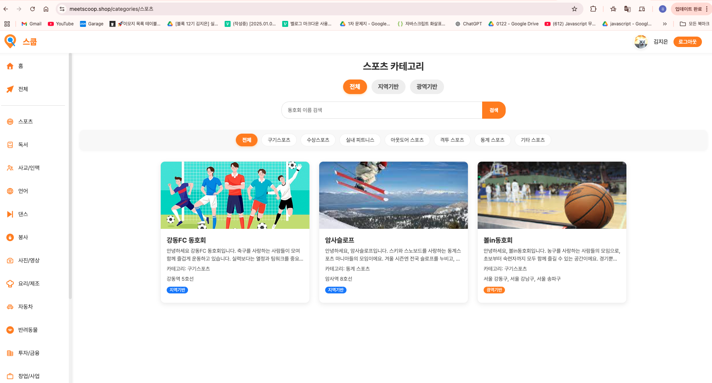
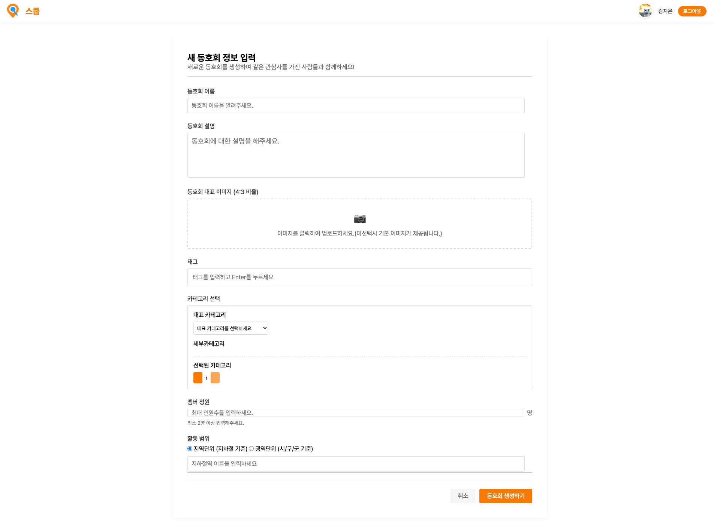
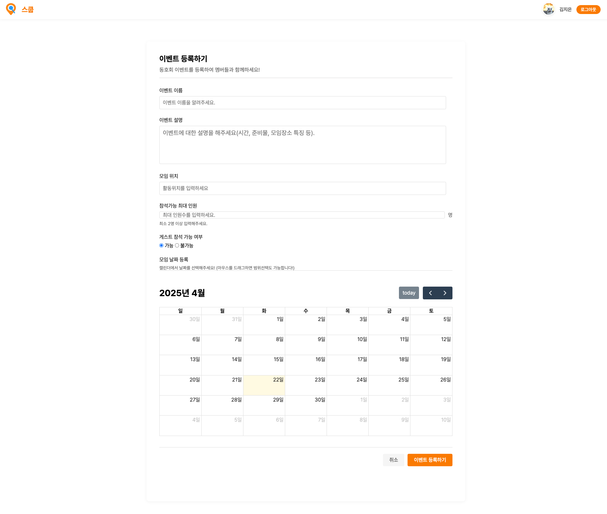
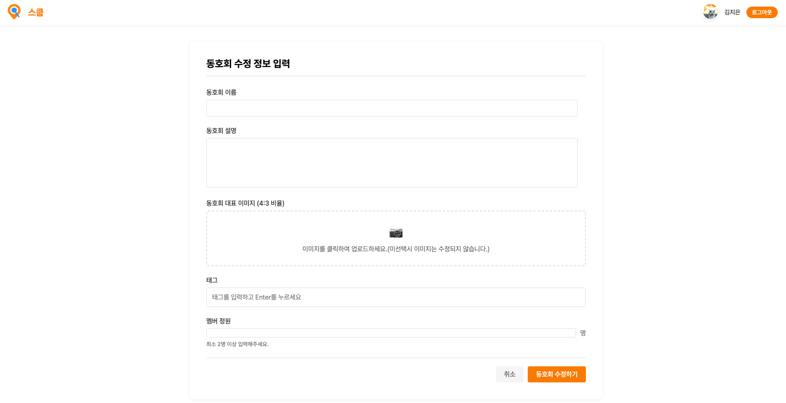

# 🎯 Node.js-Project_Scoop
---

  

<h1 align="center">Scoop</h1>

"Scoop은 '한 스푼 퍼올리다'는 의미를 담아, 사용자 지역 커뮤니티 정보를 손쉽게 접근하고 활용할 수 있도록 설계된 플랫폼입니다."

---

## 📖 목차
- [📺 프로젝트 소개](#-프로젝트-소개)
- [💬 프로젝트 개요](#-프로젝트-개요)
- [🔗 배포 주소](#-배포-주소)
- [🏷️ 주요 기능](#-주요-기능)
- [💁‍♂️ 팀원 및 기여내역](#-팀원-및-기여내역)
- [🖥 화면 구성 및 기능](#-화면-구성-및-기능)
  - [📌 동호회 탐색 페이지](#-동호회-탐색-페이지)
  - [📌 동호회 상세 페이지](#-동호회-상세-페이지)
  - [📌 동호회 추가/관리 페이지](#-동호회-추가/관리-페이지)
- [🛠 기술 스택 및 협업도구](#-기술-스택-및-협업-도구)
- [📁 프로젝트 폴더 구조 ](#-프로젝트-폴더-구조)

---
## 📺 프로젝트 소개

"Scoop"은 관심사 기반 동호회를 누구나 쉽게 찾고 참여할 수 있도록 도와주는 웹 서비스입니다.
사용자는 카테고리 또는 위치 기반으로 동호회를 탐색하고, 활동에 참여하거나 리뷰를 남길 수 있습니다.
리뷰를 작성하면 포인트가 적립되며, 동호회의 회원이 아니더라도 일일 게스트로 활동에 참여할 수 있습니다.
동호회 운영자는 활동 일정을 등록하여 활발한 동호회 활동을 유도할 수 있습니다.

---

## 💬 프로젝트 개요
- **팀명**: 수지비
- **목적**: 오프라인 활동 기반의 동호회를 지역(광역/지역)/관심사 기반으로 연결하는 웹 플랫폼 개발
- **기간**: 2025.04.02 ~ 2025.04.17 (약 2주간 진행) 
- **참여인원**: 총 3명

---

## 🔗 배포 주소
-  웹사이트: https://meetscoop.shop/

---

## 🏷️ 주요 기능
* 지역 및 지하철역 기반 동호회 추천

* 카카오맵 API를 활용한 동호회 위치 시각화

* 카카오 로그인 (카카오 Auth 연동)

* 동호회 상세 정보 열람 기능

* 동호회 등록, 수정 및 필터링 기능

* 카테고리별 동호회 목록 조회

* 동호회 좋아요(찜) 및 리뷰 작성 기능

* 캘린더를 통한 동호회 일정 등록

* 비회원 일일 게스트 참가 기능

* 동호회 활동에 따른 포인트 적립 시스템

---

## 🧑‍💻 팀원 및 기여 내역

| 이름 | 깃허브 | 주요 기여 |
|:----:|:------:|:---------|
| 김지은 | [@zzeen2](https://github.com/zzeen2) | • 전체/상세 카테고리 구현 • 동호회 생성/수정 페이지 구현 • 프로젝트 전반 UI/UX 디자인 • 프로젝트 구조 설계 및 버전 관리 • 데이터베이스 구조 설계 |
| 이수호 | [@susuholee](https://github.com/oo-dev) | • 카카오맵 API를 통한 메인 페이지 구현 |
| 비노드 | [@vinod](https://github.com/oo-dev) | • 마이페이지 및 사용자 정보 수정 기능 구현 • Sequelize 모델 정의 및 관계 설정 |

---

## 🖥 화면 구성 및 기능

### 📌 동호회 탐색 페이지

#### 🔎 전체 카테고리 페이지

  

- 모든 동호회를 한 눈에 확인할 수 있는 기본 페이지입니다.

- 동호회 이름, 관심 태그, 지역명으로 검색이 가능합니다.

- 활동 유형 필터(전체 / 지역기반 / 광역기반)를 통해 사용자 관심사에 맞는 동호회를 필터링하여 볼 수 있습니다.

- 동호회는 카드 형식으로 나열되며, 썸네일, 제목, 소개, 활동 정보, 태그 등이 함께 표시됩니다.

- 사이드바에서는 다양한 메인 카테고리를 선택할 수 있습니다.

#### 🔎 상세 카테고리 페이지

  

- 특정 카테고리를 선택하면 해당 **하위 카테고리(세부 항목)**를 추가로 선택할 수 있는 상세 페이지로 이동합니다.

- 활동 유형 필터(전체 / 지역기반 / 광역기반)는 전체 카테고리 페이지와 동일하게 제공됩니다.

- 동호회는 카드 형식으로 나열되며, 썸네일, 제목, 소개, 활동 정보, 태그 등이 함께 표시됩니다.

- 검색 결과가 없을 경우 ‘검색 결과가 없습니다’ 메시지를 제공합니다.

### 📌 동호회 상세 페이지

사용자는 동호회 상세 페이지에서 동호회의 이미지, 소개, 카테고리, 일정, 멤버, 리뷰 등의 정보를 확인할 수 있으며, 로그인 상태와 멤버 여부에 따라 가능한 기능이 다르게 표시됩니다.

  <table>
    <tr>
      <td align="center">
         
        <b>동호회 상세 페이지</b>
      </td>
      <td align="center">
         
        <b>일정 캘린더</b>
      </td>
    </tr>
    <tr>
      <td align="center">
         
        <b>멤버탭</b>
      </td>
      <td align="center">
         
        <b>리뷰탭</b>
      </td>
    </tr>
  </table>

#### 💡 페이지 기능

| 상세 페이지 주요 구성 | 기능 
|:----:|:------:|
| 동호회 정보 | • 이미지, 제목, 소개, 카테고리, 최대 인원, 태그, 현재 인원 등 표시  | 
| 찜하기 버튼 | • 로그인 시 사용 가능하며, 좋아요 상태를 시각적으로 표시 |
| 일정 탭 | • FullCalendar 달력을 활용하여 월별 동호회 활동 일정을 시각적으로 표시   • 이벤트 클릭 시 상세 정보 모달(날짜, 장소, 설명, 참여 여부) 제공 |
| 일정 참여 방식 | • 멤버는 참석 여부 투표 가능    • 비멤버는 게스트로 일일 참여 신청 가능|
| 멤버 탭 | •  운영진과 일반 멤버 목록을 프로필 이미지, 이름, 가입일과 함께 표시|
| 리뷰 탭 | • 평점 평균, 점수 분포 그래프 제공    • 작성된 리뷰 목록 확인 및 작성 가능|

#### 💡 사용자의 상태에 따른 기능 요약

| 기능 | 비로그인 | 로그인 (비회원) | 로그인 (회원) |
|:-----|:--------:|:---------------:|:------------:|
| 상세정보 조회 | ✅ | ✅ | ✅ |
| 가입신청 | ❌ | ✅ | - |
| 찜하기 | ❌ | ✅ | ✅ |
| 게스트 참여 | ❌ | ✅ | - |
| 회원 참여상태 설정 | ❌ | - | ✅ |
| 리뷰 작성 | ❌ | 게스트 참여 후 가능 | ✅ (10일에 1회) |

---

### 📌 동호회 추가/관리 페이지

 <table> <tr> <td align="center">   <b>동호회 생성 페이지</b>  이름, 설명, 대표 이미지, 카테고리, 태그, 활동 범위(지역,광역) 등을 입력하여 새로운 동호회를 생성할 수 있습니다. </td> <td align="center">   <b>이벤트 등록 페이지</b>  활동 일정을 등록하고, 위치, 정원, 게스트 허용 여부 등도 설정할 수 있습니다. </td> </tr> <tr> <td align="center" colspan="2">   <b>동호회 수정 페이지</b>  기존 동호회의 정보를 수정할 수 있으며, 이미지 미선택 시 기존 이미지가 유지됩니다. </td> </tr> </table> 

---

## 📡 API 문서

### 🔹 메인 페이지
- **`GET /`**
  - 메인 페이지를 반환합니다.

### 🔹 오른쪽 잉어영역 필터링
- **`GET /filter`**
  - 필터링된 동호회 목록 데이터를 반환합니다.

### 🔹 광역 기반 시/군구 데이터
- **`GET /api/area`**
  - 광역시도 기반의 시/군/구 GeoJSON 데이터를 json 형식으로 반환합니다.
  - **Response:** `application/json`

### 🔹 지하철 정보 데이터
- **`GET /api/station`**
  - 지하철 역사명, 위도, 경도 정보 GeoJSON 데이터를  json 형식으로 반환합니다.
  - **Response:** `application/json`

### 🔹 지하철역 마커 클릭 시
- **`GET /station`**
  - 사용자가 지하철 마커를 클릭했을 때 해당 역 관련 데이터를 반환합니다.

### 🔹 등록된 동호회 지역 데이터
- **`GET /area`**
  - 동호회가 등록된 시/군/구 데이터를 반환합니다.

---
## 🛠 기술 스택 및 협업 도구
- Frontend 

    
    
    

- Backend

    
    
    

- Database

    
    

- Version Controll

    

- Communication Toll

    
    

---

## 🛠 프로젝트 폴더 구조

📦scoopproject

 ┣ 📂 controllers
 
 ┣ 📂 json

 ┣ 📂 lib

 ┣ 📂 routers

 ┣ 📂 views

 ┣ 📂 public

 ┃ ┣ 📂 css

 ┃ ┣ 📂 images

 ┃ ┣ 📂 js

 ┣ 📜 server.js

 ┣ 📜 README.md