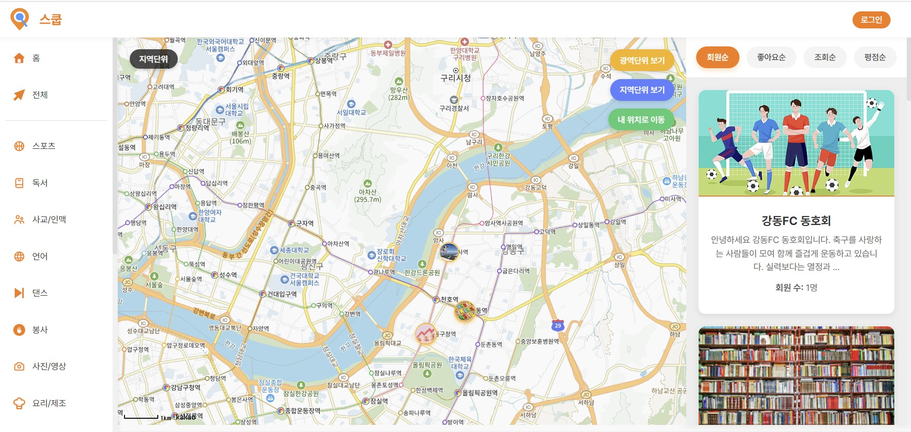

# 🧭 Node.js-Project_Scoop
---
Node.js + 카카오맵 API + 동호회 추천 사이트

## 📓목차
- [📺 프로젝트 소개](#-프로젝트-소개)
- [🖥 화면 구성](#-화면-구성)
  - [📌 메인 페이지](#-메인-페이지)
- [🏷️ 주요 기능](#️주요-기능)
- [🗓️ 개발 기간](#️-개발-기간)
- [💁‍♂️ 팀원소개](#️-팀원소개)
- [🛠 기술 스택](#-기술-스택)
- [🛠 협업 도구](#-협업-도구)
- [🛠 프로젝트 폴더 구조 ](#-프로젝트-폴더-구조)
---
## 📺 프로젝트 소개
"Scoop"은 사용자가 선택한 지역 정보를 바탕으로 동호회를 추천해주는 웹사이트입니다. 카카오맵 API를 활용해 동호회의 위치를 지도에 시각적으로 표시하여, 사용자가 직관적으로 동호회를 탐색할 수 있도록 돕습니다. 각 동호회의 상세 정보와 활동 내용을 한눈에 확인할 수 있도록 구성하였습니다.

## 🖥 화면 구성

### 📌 메인 페이지
#### 담당 : 이수호
- 사용자는 지역 기반 또는 광역 기반으로 동호회를 선택해 지도를 통해  시각적으로 확인할 수 있습니다.

- 지도에서 지역 또는 광역 단위로 생성된 동호회를 클릭하면 해당 동호회의 상세 정보를 확인할 수 있습니다.

- 로그인하지 않은 비회원도 생성된 동호회를 조회할 수 있으며, 필터 기능도 사용할 수 있습니다.

---

 ## 🏷️주요 기능
* 지역 및 지하철역 기반 동호회 추천

* 카카오맵 API를 활용한 동호회 위치 시각화

* 카카오 로그인 (카카오 Auth 연동)

* 동호회 상세 정보 열람 기능

* 동호회 등록, 수정 및 필터링 기능

* 카테고리별 동호회 목록 조회

* 동호회 좋아요(찜) 및 리뷰 작성 기능

* 캘린더를 통한 동호회 일정 등록

* 비회원 일일 게스트 참가 기능

* 동호회 활동에 따른 포인트 적립 시스템

## 🗓️ 개발 기간
* 2025.04.02(수) ~ 2025.04.18(금)

### 💁‍♂️ 팀원소개
---

  
 
     
    <a href="https://github.com/susuholee"> 팀장 : 이수호</a>
  

  

     
    <a href="https://github.com/zzeen2">팀원 : 김지은</a>
  

  

     
    <a href="https://github.com/Mr-Binod">팀원 : 비노드</a>
  

---
## 📡 API 문서

### 🔹 메인 페이지
- **`GET /`**
  - 메인 페이지를 반환합니다.

### 🔹 오른쪽 잉어영역 필터링
- **`GET /filter`**
  - 필터링된 동호회 목록 데이터를 반환합니다.

### 🔹 광역 기반 시/군구 데이터
- **`GET /api/area`**
  - 광역시도 기반의 시/군/구 GeoJSON 데이터를 json 형식으로 반환합니다.
  - **Response:** `application/json`

### 🔹 지하철 정보 데이터
- **`GET /api/station`**
  - 지하철 역사명, 위도, 경도 정보 GeoJSON 데이터를  json 형식으로 반환합니다.
  - **Response:** `application/json`

### 🔹 지하철역 마커 클릭 시
- **`GET /station`**
  - 사용자가 지하철 마커를 클릭했을 때 해당 역 관련 데이터를 반환합니다.

### 🔹 등록된 동호회 지역 데이터
- **`GET /area`**
  - 동호회가 등록된 시/군/구 데이터를 반환합니다.

---
## 🛠 기술 스택

- Frontend  

 

- Backend  

 

- Database  

 

- 지도 API  

 

## 🛠 협업 도구
---

---

## 🛠 프로젝트 폴더 구조

📦scoopproject

 ┣ 📂controllers
 
 ┣ 📂json

 ┣ 📂lib

 ┣ 📂routers

 ┣ 📂views

 ┣ 📂public

 ┃ ┣ 📂css

 ┃ ┣ 📂js

 ┃ ┣ 📂js

 ┣ 📜server.js

 ┣ 📜README.md

