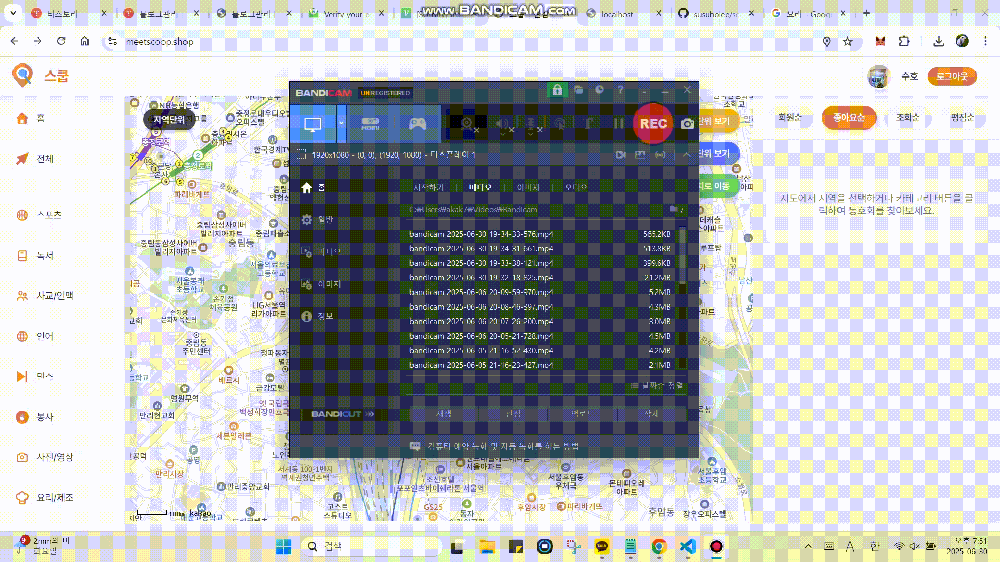
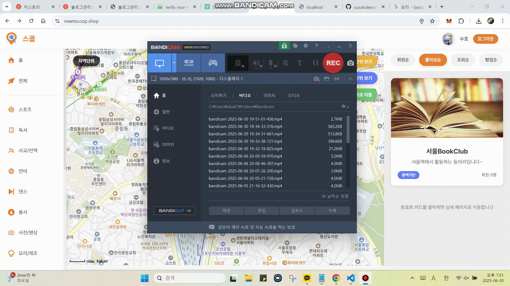
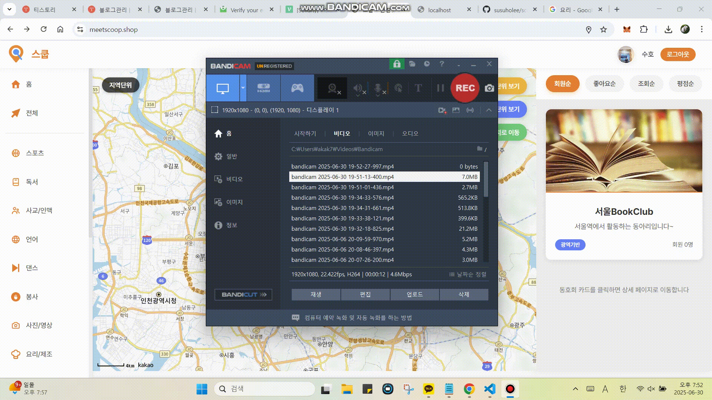
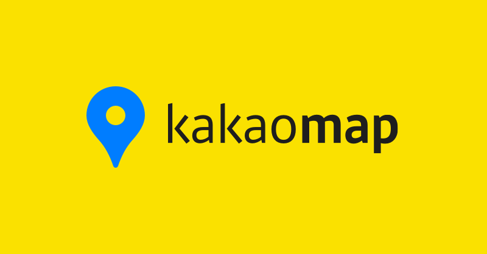

# Scoop_Project


>**Node.js + Express + KakaoMap API 기반 위치기반 동호회 추천 플랫폼**

---

## 배포 주소
- https://joinscoop.store
---

## 목차
- [개발 기간 및 협업 방식](#개발-기간-및-협업-방식)
- [프로젝트 소개](#프로젝트-소개)
- [주요 기능](#주요-기능)
- [화면 구성](#화면-구성)
- [api 문서](#api-문서)
- [담당 기능 설명](#담당-기능-설명)
- [기술 스택](#기술-스택)
- [협업 도구](#협업-도구)
- [실행 방법](#실행-방법)
- [이슈 상황](#이슈-상황)
- [개선 방향](#개선-방향)
- [향후 확장 방향](#향후-확장-방향)
- [느낀 점](#느낀-점)
---

## 개발 기간 및 협업 방식
- **개발 기간**: 2025.04.02 ~ 2025.04.18 (약 2주)
- **팀 구성**: 3인 협업 프로젝트
- **협업 방식**: GitHub + Notion 기반 협업 및 버전 관리

---

## 프로젝트 소개

“Scoop”은 사용자가 선택한 지역 정보를 바탕으로 동호회를 추천해주는 **위치 기반 동호회 탐색 플랫폼**입니다. 카카오맵 API를 통해 지역/광역 단위로 동호회를 지도 위에 시각화하여 누구나 쉽게 탐색할 수 있도록 구현했습니다.

---

## 주요 기능

- 카카오맵 기반 동호회 위치 마커 표시
- 지역 및 광역 단위 필터링 기능
- 비회원도 지도 탐색 및 필터 사용 가능
- 동호회 등록, 수정, 삭제 기능
- 동호회 좋아요(찜) 및 리뷰 기능
- 일정 등록용 캘린더 UI
- 비회원 일일 게스트 참가 기능
- 활동 기반 포인트 적립 시스템

---

## 화면 구성

### 지역 단위 동호회 조회


### 광역 단위 동호회 조회


### 필터 기능



## API 문서
[](https://app.swaggerhub.com/apis-docs/suho-5b1/joinscoop/1.0.0#)

---

## 담당 기능 설명

### 메인 페이지 + 지도 연동
- 카카오맵 API 기반 지도 렌더링
- 지역/광역 필터 적용 시 마커 동적 생성
- 필터링 시 해당하는 동호회 조회
- 정렬 조건에 따른 동호회 리스트 및 마커 재구성
- 비회원도 필터 탐색 가능
---

## 기술 스택

### Frontend
<p>
  
  
  
</p>

### Backend
<p>
  
  
</p>

### Database
<p>
  
  
</p>

### 지도 API
<p>
  
</p>

---

## 협업 도구
<p>
  
  
</p>

---

## 실행 방법

1. 저장소 클론  
```bash
git clone https://github.com/susuholee/scoop_project.git
```
2. 프로젝트 폴더로 이동
```bash
cd scoop_project
```
3. 의존성 설치
```bash
npm install
```
4. 서버 실행
```bash
node server.js
```

## 이슈 상황

| 번호 | 이슈 내용 |
|------|-----------|
| 1 | 동호회가 지역 기반 또는 광역 단위로 명확히 분리되지 않음 → 하나의 위치 정보만 저장되어, 지역/광역 구분이 불명확해 사용자 탐색에 혼란 발생 |
| 2 | 같은 시/군구나 동일 지하철역에 여러 동호회 등록 시 → 지도에서 마커가 겹쳐, 여러 동호회 존재 여부를 한눈에 파악하기 어려움 |
| 3 | 지역 단위 동호회 등록 시 지하철 마커가 누락되는 경우 발생 |
| 4 | 일부 필터링 기능이 정상 작동하지 않음|


---

## 해결 방안

| 문제 | 해결 방법 |
|------|-----------|
| 지역/광역 단위 동호회 구분 문제 | 지역 단위는 지하철역 좌표, **광역 단위는 시·군·구 중심 좌표(API)**를 활용하여 지도에서 각기 다른 방식으로 시각화 |
| 마커 겹침 문제 | 동호회 회원 수에 따라 마커 크기 차등 적용 → 다수 동호회가 있을 경우 시각적 우선순위 제공|
| 마커 표시 문제 | 등록 시 입력받은 지하철역명을 기준으로 좌표 매칭 → JSON 데이터 가공 단계에서 일치 확인 및 자동 매핑 처리|

---
## 개선 방향

| 항목 | 개선 방향 | 기대 효과 |
|------|------------|------------|
| 지도 마커 초기화 처리 | 필터 변경 시 기존 마커를 초기화하여 다시 렌더링 | 중복 마커 제거 및 지도 UI 안정성 향상 |
| 마커 겹침 시각화 개선 | 동일 위치에 다수 동호회가 존재할 경우 마커 크기 또는 클러스터 처리로 시각적 구분 | 사용자 혼란 최소화 및 접근성 향상 |
| 지역/광역 단위 구분 | 지역 단위는 지하철역 기준, 광역 단위는 시·군·구 중심 좌표로 분리 표시 | 필터링 시 구분이 명확해져 사용성 향상 |
| 필터링 안정화 | 필터 선택 시 지도 및 리스트 영역이 정확히 동기화되도록 로직 정비 | 예외 상황 제거 및 UX 일관성 확보 |
| 정렬 기능 구현 | 회원 수, 평점, 리뷰 수 기준 정렬 기능 추가 및 백엔드 연동 | 사용자가 관심 있는 기준으로 동호회 탐색 가능 |

---
## 향후 확장 방향

| 항목 | 확장 방향 | 기대 효과 |
|------|------------|------------|
| 마커 클러스터링 적용 | 지도에 마커가 다수 존재할 경우 자동 클러스터링 적용 | **대규모 데이터 대응** 및 지도 렌더링 성능 향상 |
| 동호회 추천 알고리즘 | 사용자 **지역 + 선호 카테고리 기반**으로 동호회 추천 기능 구현 | 개인화된 탐색 경험 제공, **활동 유도 증가** |
| 알림 기능 추가 | 일정 등록, 리뷰, 좋아요 등 이벤트 발생 시 알림 제공 | 사용자 **참여율 및 리텐션 향상** |
| 관리자 페이지 구성 | 동호회 제재, 신고 관리, 활동 통계 확인 등의 백오피스 기능 개발 | 서비스 운영의 **안정성과 신뢰성 강화** |
| 모바일 최적화 | 반응형 UI 적용 및 모바일 기기 대응 | **접근성 향상 및 다양한 기기 환경 지원** |
| 사용자 실시간 위치 기반 | 사용자의 현재 위치 기반 동호회 추천/정렬 기능 | **즉시성 높은 탐색 UX 제공**, 위치 기반 콘텐츠 확장 가능성 |

## 느낀 점
이번 프로젝트를 통해 **카카오맵과 DB를 연동하는 흐름**을 실질적으로 이해할 수 있었고, 지도 API와 동적인 데이터베이스를 연결하여 **UI를 구성하는 실제 개발 프로세스**를 경험할 수 있었습니다.

특히 사용자 접근성과 서비스 확장성을 동시에 고려하여 개발을 진행하면서,
기능 구현뿐 아니라 **사용자 중심 UX 설계와 피드백 반영의 중요성**을 깊이 체감했습니다.

또한 GitHub 기반 협업과 역할 분담을 통해 **효율적인 팀 개발** 경험도 쌓을 수 있었으며,  
실제 사용자 시나리오를 중심으로 기능을 다듬고 확장하는 과정에서 **실무적인 감각**을 익힐 수 있었습니다.


